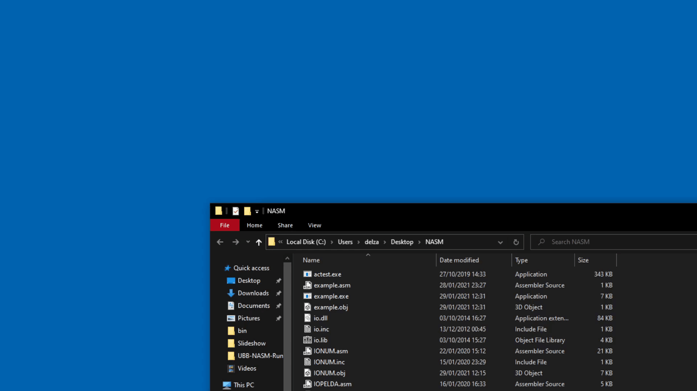
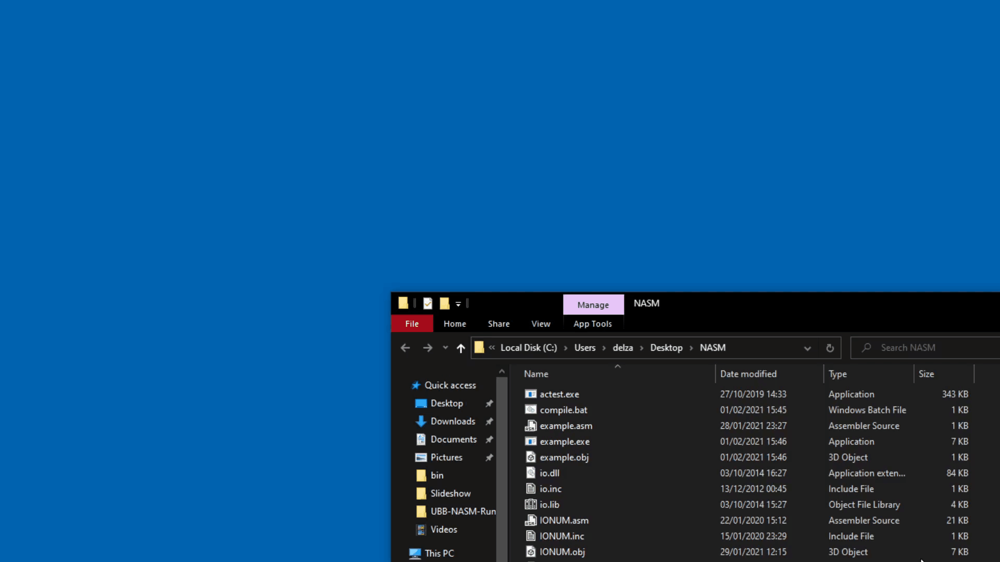

# Manually compiling UBB NASM projects

Everything should be in the **same directory** for the
sake of simplicity.

:bulb: You should create a **script** which you can then 
run any time, without having to scroll through command
history or retype anything. If something needs to be changed
you can just edit the script itself.



## Compile single file project

`example.asm` ↴

```assembly
%include 'io.inc'

global main

section .text

main:
    mov     eax, str
    call    io_writestr

    ret

section .data
    str:    db  "Hello, world!", 0
```
<br/>

`compile.bat` ↴

```batch
@echo off

.\nasm.exe -f win32 example.asm && ^
.\nlink.exe example.obj -lio -o example.exe && ^
.\example.exe

echo.
pause
```

- `@echo off` keeps the console clean


- `.\nasm.exe -f win32 example.asm` compiles `example.asm` into `example.obj`  
  `-f win32` is for format Win32 (i386)  
  More details [here](https://nasm.us/doc/nasmdoc2.html)


- `&&` executes the next command only if the first one
  succeeds


- `^` escapes the next character (new line in this case)
  so commands can be placed in new lines with `&&`


- `.\nlink.exe example.obj -lio -o example.exe` creates the
  executable from `example.obj` and `io.lib`  
  `-lio` is required for `%include 'io.inc'` to work  
  `-lmio` for `'mio.inc'`  
  `-o example.exe` is the output path/name, if you omit this,
  then it defaults to `a.exe`


- Finally, if everything is **OK** so far, we run the executable
  `.\example.exe`


- `echo.` just prints a new line


- `pause` is for keeping the console from closing, but
  it might be annoying if you run the script from
  a terminal directly, in that case it should be left out



## Compile multiple file project

Say you want to compile `STRPELDA.asm`, like in the demo image
you might've seen  

It has the following includes ↴

```assembly
%include 'IOSTR.inc'
%include 'STRINGS.inc'
%include 'IONUM.inc'
```

> :information_source: These all have their `*.asm` counterparts that need to be
> compiled and those `*.asm` files have their own includes  
> Some are shared, like `IOSTR.inc` both in `STRPELDA.asm`
> and `IONUM.asm`, or `mio.inc` in 
> everything except `STRPELDA.asm`

You probably get the idea from this code snippet ↴

```batch
@echo off

.\nasm.exe -f win32 IOSTR.asm && ^
.\nasm.exe -f win32 STRINGS.asm && ^
.\nasm.exe -f win32 IONUM.asm && ^
.\nasm.exe -f win32 STRPELDA.asm && ^
.\nlink.exe STRPELDA.obj IOSTR.obj STRINGS.obj IONUM.obj -lmio -o STRPELDA.exe && ^
.\STRPELDA.exe

echo.
pause
```
